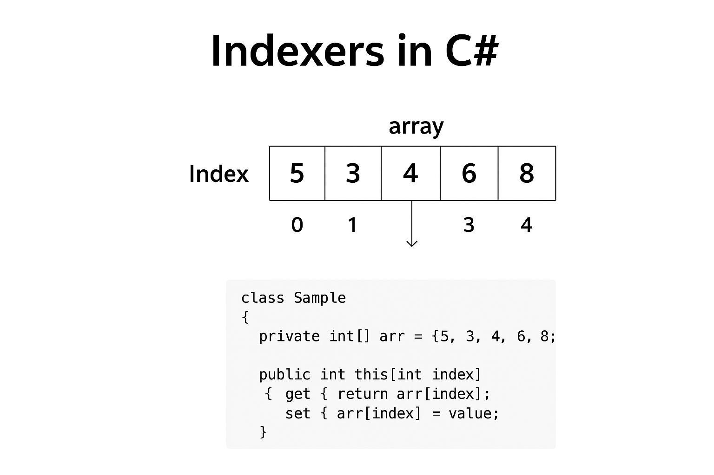

# 📘 Indexers in C#



## 💡 Project Examples
This project includes two practical examples of indexers in C#:

1. **IP Address Manager** (`IP.cs`):
   - Example of simple indexing
   - Uses 1D array indexing
   - Demonstrates value validation
   - Located in: `IP.cs`

2. **Sudoku Grid Manager** (`Suduko.cs`):
   - Example of 2D array indexing
   - Uses matrix-style access `[row, col]`
   - Includes input validation
   - Located in: `Suduko.cs`

You can find the implementation and usage of both examples in the project files. The `Program.cs` file contains demonstrations of how to use both indexers.

## 📑 Table of Contents
- [What is an Indexer?](#-what-is-an-indexer)
- [Key Notes](#-key-notes)
- [Syntax](#-syntax)
- [Basic Example](#️-basic-example)
- [Indexer with Validation](#-indexer-with-validation)
- [Indexer with String Keys](#-indexer-with-string-keys)
- [Multi-Dimensional Indexer](#-multi-dimensional-indexer)
- [Real Example: Sudoku Grid](#-real-example-sudoku-grid-indexer)
- [Indexers vs Properties](#-indexers-vs-properties)
- [Full Example](#-full-example-all-in-one)
- [Summary](#-summary)
- [Best Practices](#-best-practices)
- [Common Mistakes](#-common-mistakes-to-avoid)

## 🧩 What is an Indexer?

An **indexer** in C# allows an object to be **indexed like an array**.  
It provides a way to access the internal data of a class using **array-like syntax**, without exposing the actual data structure.

> Think of it as a **property with parameters**.

## 🧠 Key Notes

- Indexers do not have a name, always declared using `this`
- Can be overloaded with different parameter types
- Can be read-only (get) or write-only (set)
- Often used with collections, matrices, dictionaries, and custom containers

An **indexer** in C# allows an object to be **indexed like an array**.  
It provides a way to access the internal data of a class using **array-like syntax**, without exposing the actual data structure.

> Think of it as a **property with parameters**.

---

## 🧠 Syntax

```csharp
public return_type this[int index]
{
    get { // return value at index }
    set { // assign value at index }
}
```

## ⚙️ Basic Example

```csharp
using System;

class Sample
{
    private int[] numbers = new int[5];

    public int this[int index]
    {
        get { return numbers[index]; }
        set { numbers[index] = value; }
    }
}

class Program
{
    static void Main()
    {
        Sample s = new Sample();
        s[0] = 10;
        s[1] = 20;

        Console.WriteLine(s[0]); // 10
        Console.WriteLine(s[1]); // 20
    }
}
```

## 🔁 Indexer with Validation

You can add error checking to ensure safe indexing:

```csharp
using System;

class SafeArray
{
    private int[] data = new int[5];

    public int this[int index]
    {
        get
        {
            if (index < 0 || index >= data.Length)
                throw new IndexOutOfRangeException("Index out of range!");
            return data[index];
        }
        set
        {
            if (index < 0 || index >= data.Length)
                throw new IndexOutOfRangeException("Index out of range!");
            data[index] = value;
        }
    }
}

class Program
{
    static void Main()
    {
        SafeArray arr = new SafeArray();
        arr[2] = 50;
        Console.WriteLine(arr[2]); // 50
    }
}
```

## 🔡 Indexer with String Keys

Indexers can also use non-integer keys such as strings:

```csharp
using System;
using System.Collections.Generic;

class Person
{
    private Dictionary<string, string> info = new Dictionary<string, string>();

    public string this[string key]
    {
        get
        {
            return info.ContainsKey(key) ? info[key] : "Not Found";
        }
        set
        {
            info[key] = value;
        }
    }
}

class Program
{
    static void Main()
    {
        Person p = new Person();
        p["Name"] = "Mahmoud Hany";
        p["City"] = "Ismailia";

        Console.WriteLine(p["Name"]);
        Console.WriteLine(p["City"]);
        Console.WriteLine(p["Age"]); // Not Found
    }
}
```

## 🧮 Multi-Dimensional Indexer

You can define indexers with multiple parameters:

```csharp
using System;

class Matrix
{
    private int[,] data = new int[3, 3];

    public int this[int row, int col]
    {
        get { return data[row, col]; }
        set { data[row, col] = value; }
    }
}

class Program
{
    static void Main()
    {
        Matrix matrix = new Matrix();
        matrix[0, 1] = 5;
        matrix[1, 2] = 10;

        Console.WriteLine(matrix[0, 1]); // 5
        Console.WriteLine(matrix[1, 2]); // 10
    }
}
```

## 🎯 Real Examples from Our Project

### 1️⃣ IP Address Manager

Here's a practical example using an indexer to manage IP address segments:

```csharp
public class IP
{
    private int[] segments = new int[4];

    // Indexer for accessing or modifying IP segments
    public int this[int index]
    {
        get => segments[index];
        set
        {
            if (!IsValidSegment(value))
                throw new ArgumentOutOfRangeException($"Segment value {value} is invalid. Must be between 0 and 255.");
            segments[index] = value;
        }
    }

    // Property to get the full address
    public string Address => string.Join(".", segments);

    // Helper method for validation
    private bool IsValidSegment(int value) => value >= 0 && value <= 255;
}
```

Usage Example:
```csharp
IP firstIP = new IP(192, 168, 45, 12);
Console.WriteLine($"First IP Address: {firstIP}"); // 192.168.45.12
int firstSegment = firstIP[0];                     // Get first segment: 192
```

### 2️⃣ Enhanced Sudoku Grid

Here's an advanced example using an indexer with validation for a Sudoku grid:

```csharp
public class Sudoku
{
    private int[,] _matrix;
    private const int Size = 9;

    public int this[int row, int col]
    {
        get
        {
            if (!IsValidIndex(row, col))
                return -1;
            return _matrix[row, col];
        }
        set
        {
            if (!IsValidPosition(row, col, value))
                return;
            _matrix[row, col] = value;
            Console.WriteLine($"✅ Value {value} successfully placed at [{row},{col}].");
        }
    }

    // Validation helpers
    private bool IsValidIndex(int row, int col)
    {
        bool valid = row >= 0 && row < Size && col >= 0 && col < Size;
        if (!valid)
            Console.WriteLine($"⚠️ Invalid position [{row},{col}]. Must be within 0–{Size - 1}.");
        return valid;
    }

    private bool IsValidPosition(int row, int col, int value)
    {
        if (!IsValidIndex(row, col))
            return false;
        if (value < 1 || value > 9)
        {
            Console.WriteLine($"⚠️ Invalid value ({value}). Sudoku numbers must be between 1-9.");
            return false;
        }
        return true;
    }
}
```

Usage Example:
```csharp
Sudoku sudoku = new Sudoku(input);
sudoku[4, 4] = 5;                    // ✅ Valid: sets value 5 at position [4,4]
Console.WriteLine(sudoku[4, 4]);      // Gets value at position [4,4]
sudoku[9, 0] = 3;                    // ⚠️ Invalid: position out of range
sudoku[0, 0] = 15;                   // ⚠️ Invalid: value must be 1-9
```


## 🧱 Indexers vs Properties

| Feature | Property | Indexer |
|---------|----------|---------|
| Accessed by | Name | Index |
| Parameters | No | Yes |
| Syntax | obj.Property | obj[index] |
| Use Case | Access single value | Access multiple related values |

## 🚀 Full Example (All in One)

```csharp
using System;
using System.Collections.Generic;

class Library
{
    private Dictionary<int, string> books = new Dictionary<int, string>();

    public string this[int id]
    {
        get { return books.ContainsKey(id) ? books[id] : "Book not found"; }
        set { books[id] = value; }
    }

    public string this[string title]
    {
        get
        {
            foreach (var pair in books)
                if (pair.Value == title)
                    return $"Book found with ID {pair.Key}";
            return "Book not found";
        }
    }
}

class Program
{
    static void Main()
    {
        Library lib = new Library();
        lib[1] = "C# Basics";
        lib[2] = "OOP Concepts";
        lib[3] = "Indexers in C#";

        Console.WriteLine(lib[2]);          // OOP Concepts
        Console.WriteLine(lib["C# Basics"]); // Book found with ID 1
        Console.WriteLine(lib["Python"]);    // Book not found
    }
}
```

Output:
```
OOP Concepts
Book found with ID 1
Book not found
```

## 🧾 Summary

| Concept | Description |
|---------|-------------|
| Indexer | Allows objects to be indexed like arrays |
| Overloading | Multiple indexers with different parameter types |
| Multi-Dimensional Indexers | Enable matrix-like access |
| Use Cases | Collections, matrices, dictionaries, and containers |

## 💡 Example Analogy

Think of an Indexer as a hotel receptionist —
You give them a room number (index), and they give you the guest (value) inside.

## ✨ Best Practices

1. **Validation**: Always validate index values to prevent exceptions
2. **Error Handling**: Provide meaningful error messages when invalid indices are used
3. **Documentation**: Document the index parameter requirements and return value types
4. **Performance**: Consider caching frequently accessed values for better performance
5. **Readability**: Use clear, meaningful parameter names for multi-parameter indexers
6. **Consistency**: Keep indexer behavior consistent with collection indexing patterns

## 🚫 Common Mistakes to Avoid

1. Not validating index values
2. Performing expensive operations in indexer get/set
3. Using indexers when a method would be more appropriate
4. Not handling out-of-range scenarios
5. Overusing indexers where regular properties would suffice

---

**Author:** Mahmoud Hany  
**Language:** C#  
**Topic:** Indexers
